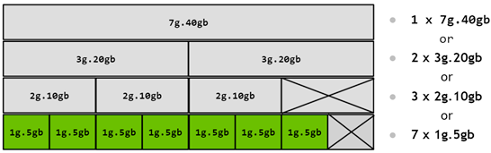

# Meetup 복기

사용 방식
* ssh 에서 지피유가 깔린 도커 연결해줌
* 컨테이너에 접속한 사용자가 job을 체인에 쏘면 알아서 돌리고 결과를 리턴해줌

이를 확장해서 기본 컨테이너 이미지 -> 컨테이너 이미지 스왑 

ssh로 접속해서 할당하는 로직 영역
API 서버 하나 만들거고 (1차)
카뎃 컨테이너에서 API로 콜 보낼 수 있어야함(2차)

## GPU 서버에서 모니터링 할만한 게 뭐가 있을까?
* CPU, GPU, RAM, Disk R/W, Network 그외 기타 리소스들
  * GPU server 에서 언제 이 리소스들이 사용되고, 어떠한 이슈가 있을 것이라 예상되는가? 그밖에 뭔가 중요한게 있나? 계속 업데이트 해보자.
    * CPU
      * 언제 CPU 사용량이 올라갈까?
        * CPU를 사용한 데이터의 전처리가 필요할 시?
      * ML을 수행할 때 CPU 성능에 따른 GPU 의 병목현상이 발생하는가?
        * 어떤 ML을 돌리는가에 따라 케바케인듯
    * GPU
      * 현재 몇개의 GPU가 있는지 모르겠지만... 2개 이상이라는 가정하에... 어떤 리소스 확인이 필요할 것인가.
        * 전체 사용량
        * 각 GPU 별 사용량
        * MIG 당 사용량 -> MIG 가 어떤 사용자에게 할당됐는지도 확인이 되나?
        * MIG 가 어떻게 나뉘어져 있는지도 모니터링이 되나? -> MIG profile 이 변경될수도 있는가?
      * Nvidia 는 데이터 로딩 라이브러리(DALI)도 제공해준다.(데이터 전처리를 GPU가 처리)
    * RAM
      * I/O 데이터셋에 의한 DRAM 사용량 초과 -> Out of Memory
    * Network
      * 사용자가 Container 에서 작업한 결과물을 외부로 이전
      * 데이터셋이 외부 스토리지에 있는경우
    * Disk
      * 사용자가 Container 를 사용하면서 대용량을 저장해야하는 상황이 있는가? -> 결과가 계산된 모델?같은 경우에 용량이 큰 것 같던데..
        * 사용자의 Input data에 따라 위와 같은 상황이 발생할 수 있을 듯...
      * 동일한 프로그램(아나콘다/주피터 놑북)을 거진 다 사용하는것 같은데... 이를 컨테이너마다 설치하는것이 맞는것인가?
    * 기타
      * Power
      * 온도
      
  
## 모니터링에 대하여...
1. 사용자에게 주어지는 모든 리소스들은 모니터링의 대상이 될 듯 싶음.
   * 몇 가지 정해진 도커 이미지(리소스 할당량에 따라 이미지 종류를 나누는 것인가?)를 제공하고자 하는 것 같은데... 그렇다면 사용자는 한정된 compute resource 에 대해 직접 ML 방식을 최적화를 해야할 것이고... 그럼 사용자는 자신에게 주어진 가용 리소스가 얼마나 되고, 현재 사용량이 어떤지 알고싶지 않을까?
   * 이 정보를 통해 사용자에게 어떠한 인사이트를 전달할수도. -> ex) 전처리 최적화가 필요하다 / CPU 사용에 비해 GPU 사용이 효율적이지 못하다
3. 운영자 입장에서는 서버 운영에 치명적일 수 있는 리소스 사용 감시가 필요하지 않을까 -> 이와 같은 케이스는 뭐가 있을까

## 궁금한 것
* GPU 서버의 하드웨어는 어떻게 구성돼있는지?
[자세한 SPEC](https://docs.nvidia.com/dgx/dgx-station-a100-user-guide/index.html)
* 왜 도커를 사용하는것인지?
* MIG 가 어떤 사용자에게 할당됐는지도 확인이 되나?
* MIG profile 이 필요에 따라 동적으로 정의할 수 있는가? 
* MIG profile  구성에 따라 Docker 이미지를 매핑해야 하는 것인가?
* 컨테이너마다 동일한 프로그램(아나콘다/주피터 놑북)을 설치하는것이 맞는것인가?
* GPU 의 경우 기술적인 한계에 사용자의 필요에따라 동적으로 Scaling 할 수 다면... 그렇다면 그 외의 리소스는 가능한가? -> 이 부분이 도커 이미지 별로 나누어서 해결이 되는건가?
* 현재 SFTP로 접속시 도커 컨테이너로 보이는? 디렉토리(admin, nvidia, 각 사용자별 디렉토리)가 다 보이는데... Home 하위 디렉토리는 permission denied 뜨긴함. 이게 맞는것인가?

## 그 외 필요해 보이는 것
1. 초기 사용자를 위한 server Infra 설명이 있으면 좋을 것 같다.
2. 사용자가 ssh를 통해 접속하고, GPU 리소스를 사용하는 일련의 과정에 대한 설명 -> 메뉴얼이 있는가?